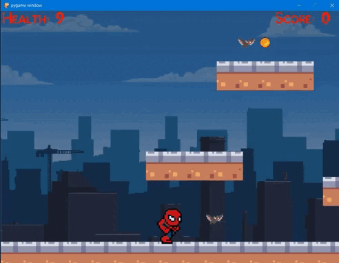

# [Создание платформера на Python, используя pygame](https://github.com/dzyundzya/platformer_pygame)

### Содержание:

1. [О проекте](#о-проекте)
2. [Как запустить](#как-запустить)
3. [Управление](#управление)
4. [Проект сделал](#проект-сделал)
 

Этот проект содержит основную логику для создания платформера. Реализован на Python, используя библиотеку pygame.

## О проекте

В игре реализованы основные механизмы классического платформера. С использованием ООП реализован персонаж, враг, дизайн уровней и функция метания предметов. Добавлено отображение здоровья и количество монет, также добавлена озвучка действий. Код можно адаптировать под любой платформер.

## Как запустить

- $ pip install -r requirements.txt
- $ python main.py

## Управление

- __Left__ и __A__: движение влево
- __Right__ и __D__: движение вправо
- __Up__ и __W__: прыжок
- __Space__: фаербол

## Почему я делал этот проект?

- Отличная возможность улучшить свои базовые навыки программирования на Python.
- Увлекательный и интерактивный способ погрузиться в игровое программирование.
- Возможность попрактиковаться в игровых механиках и использовании библиотеки Pygame.

## Проект сделал:
### [✍️ Dzyundzya Alexandr](https://github.com/dzyundzya)
